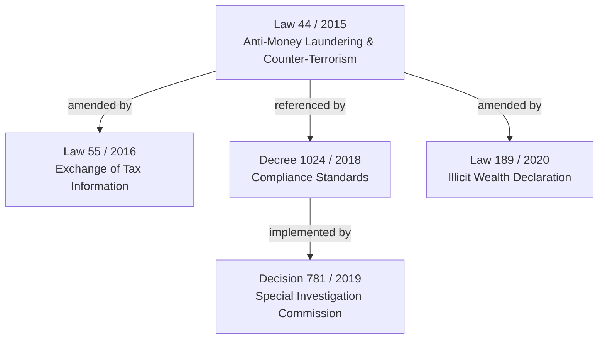

# 05 — Legislative Genealogy

Explore how major Lebanese laws are amended, referenced, and executed over time.

```sql lineage_data
select * from gazette.amendment_graph;
```

## Case Study: Anti-Money Laundering Framework (Law 44 / 2015)



---

## Registered Legislative Relationships

<DataTable data={lineage_data} search="true" pagination="true">
    <Column id="source_title" title="Original Act" />
    <Column id="relationship_type" title="Relation" />
    <Column id="target_title" title="Modifying Act" />
    <Column id="source_year" title="Year" />
    <Column id="description" title="Context" />
</DataTable>
